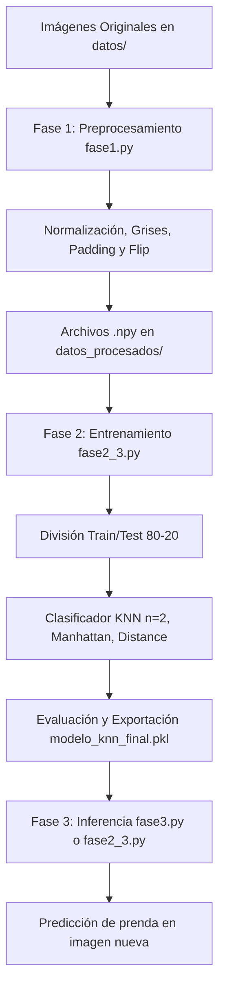

# Documentación del Modelo de Clasificación de Prendas con KNN

Esta documentación describe detalladamente el funcionamiento del proyecto de Machine Learning diseñado para clasificar imágenes de tres prendas de ropa diferentes utilizando el algoritmo supervisado **K-Nearest Neighbors (K-Vecinos Más Cercanos - KNN)**.

---

## Arquitectura del Proyecto y Flujo de Trabajo

El flujo de trabajo del proyecto está dividido en tres fases principales estructuradas en distintos scripts de Python:



---

## Análisis Detallado de los Componentes

### 1. Fase 1: Preprocesamiento de Imágenes ([fase1.py](file:///d:/02%20-%20Universidad/09%20-%20Noveno%20Cuatrimestre/Extraccion%20de%20conocimiento%20en%20BDs/unidad%203/AlgoritmoML/fase1.py))
El preprocesamiento es crucial para que el algoritmo KNN funcione de manera eficiente, ya que este algoritmo se basa en distancias entre píxeles y es altamente sensible a diferencias de tamaño, iluminación y traslación.

#### Función de Preprocesamiento (`procesar_imagen`)
Cada imagen pasa por los siguientes procesos secuenciales utilizando la librería `PIL` (Pillow):
*   **Conversión a escala de grises (`convert('L')`):** Reduce la dimensionalidad del canal de color de 3 canales (RGB) a 1 canal de intensidad de gris. Esto previene que el color sesgue la clasificación y disminuye la cantidad de datos a procesar en un factor de 3.
*   **Autocontraste (`ImageOps.autocontrast`):** Maximiza el contraste de la imagen al mapear el píxel más oscuro a negro y el más claro a blanco. Esto normaliza los problemas causados por condiciones de iluminación inconsistentes.
*   **Redimensionamiento con Padding Blanco (`thumbnail` y `paste`):** 
    1. Se reduce la imagen manteniendo su proporción original hasta que su lado más grande mida como máximo **128 píxeles** (`TAMAÑO`).
    2. Se genera un lienzo cuadrado de color blanco (valor `255`) de $128 \times 128$ píxeles.
    3. Se pega la imagen redimensionada centrada sobre el lienzo. Esto evita distorsiones geométricas en la prenda y asegura que todos los datos tengan exactamente el mismo tamaño ($128 \times 128$).
*   **Normalización de píxeles (`/ 255.0`):** Convierte el array de bytes $[0, 255]$ a valores de punto flotante en el rango $[0.0, 1.0]$. Esto mejora la estabilidad numérica del clasificador.

#### Aumento de Datos (Data Augmentation)
Para mejorar la robustez del modelo y evitar el sobreajuste (overfitting), el preprocesamiento realiza un reflejo horizontal:
*   Se guarda la imagen procesada original (`.npy`).
*   Se genera una versión volteada horizontalmente (`np.fliplr(img_procesada)`) y se guarda como `_flip.npy`.
*   Esto **duplica** la cantidad de imágenes de entrenamiento, permitiendo que el clasificador reconozca las prendas sin importar si están orientadas a la izquierda o derecha.

---

### 2. Fase 2: Entrenamiento y Evaluación ([fase2_3.py](file:///d:/02%20-%20Universidad/09%20-%20Noveno%20Cuatrimestre/Extraccion%20de%20conocimiento%20en%20BDs/unidad%203/AlgoritmoML/fase2_3.py))
Este script se encarga de estructurar el conjunto de datos, entrenar al clasificador de Scikit-Learn y evaluar su desempeño.

#### Carga y Aplanamiento de Datos
*   Busca los archivos `.npy` dentro del directorio `datos_procesados/`.
*   Cada imagen preprocesada de $128 \times 128$ se aplana con `flatten()` para convertirse en un **vector unidimensional de 16,384 características** (valores numéricos de píxeles).
*   Se genera la matriz de datos $X$ (características) y el vector de etiquetas $y$ (los nombres de las subcarpetas que corresponden a las clases de ropa).

#### División del Conjunto de Datos (`train_test_split`)
*   Se utiliza un **80% de los datos para entrenamiento** y un **20% para pruebas**.
*   `stratify=y` asegura que la distribución de clases en el conjunto de prueba sea idéntica a la del conjunto de entrenamiento, evitando desbalances que puedan sesgar los resultados.
*   `random_state=42` garantiza la reproducibilidad de la división en futuras ejecuciones.

#### Configuración del Modelo KNN
El clasificador `KNeighborsClassifier` se define con los siguientes hiperparámetros optimizados:
```python
knn = KNeighborsClassifier(
    n_neighbors=2,
    metric='manhattan',
    weights='distance'
)
```
*   **`n_neighbors=2`:** Determina que la etiqueta de una nueva imagen se asignará considerando los 2 vecinos más cercanos del espacio vectorial de 16,384 dimensiones.
*   **`metric='manhattan'` (Distancia L1):** Mide la distancia como la suma de las diferencias absolutas entre las coordenadas de los vectores:
    $$d(p, q) = \sum_{i=1}^{n} |p_i - q_i|$$
    En espacios de alta dimensionalidad (como las imágenes aplanadas), la distancia Manhattan suele ser más robusta y discriminativa que la distancia Euclídea ordinaria.
*   **`weights='distance'`:** Asigna un peso mayor a los votos de los vecinos que están más cerca de la consulta, lo que ayuda a romper empates de manera inteligente y mejora la precisión en fronteras de decisión difusas.

#### Evaluación y Exportación
*   Se generan métricas estándar sobre el conjunto de test:
    *   **Accuracy (Exactitud):** Proporción de predicciones correctas sobre el total.
    *   **Matriz de Confusión:** Tabla que describe el rendimiento del modelo mostrando dónde se confunden las clases.
    *   **Reporte de Clasificación:** Muestra la precisión, recall y puntuación F1 por cada una de las 3 prendas.
*   **`joblib.dump`:** Serializa el modelo entrenado y sus vecinos en el archivo binario `modelo_knn_final.pkl` para poder ser reutilizado rápidamente sin volver a entrenar.

---

### 3. Fase 3: Inferencia ([fase3.py](file:///d:/02%20-%20Universidad/09%20-%20Noveno%20Cuatrimestre/Extraccion%20de%20conocimiento%20en%20BDs/unidad%203/AlgoritmoML/fase3.py))
Este archivo representa el modelo en producción o uso real:
1.  **Carga del modelo (`joblib.load`):** Instancia de manera instantánea el clasificador entrenado.
2.  **Preprocesamiento dinámico:** La imagen de entrada es preprocesada usando la función exacta de la Fase 1 (`procesar_imagen`).
3.  **Alineación de dimensiones:** Se aplana la matriz a un vector de 16,384 elementos y se reestructura con `reshape(1, -1)` para simular un lote de tamaño 1 (una sola muestra a predecir).
4.  **Predicción (`predict`):** El modelo KNN calcula las distancias de Manhattan con el dataset de entrenamiento almacenado en el archivo `.pkl`, pondera los 2 vecinos más cercanos y retorna el nombre de la clase de prenda ganadora.

---

## Resumen de Hiperparámetros y Decisiones de Diseño

| Parámetro / Decisión | Valor Seleccionado | Razón Técnica |
| :--- | :--- | :--- |
| **Tamaño de Imagen** | `128x128` | Balance óptimo entre retención de detalles de la ropa y costo computacional de cálculo de distancias. |
| **Normalización** | `[0.0, 1.0]` | Reduce la disparidad en las magnitudes de la distancia entre píxeles claros y oscuros. |
| **Data Augmentation** | Reflejo horizontal (`flip`) | Duplica el tamaño de los datos de forma artificial previniendo el sobreajuste ante orientaciones inversas. |
| **Número de Vecinos ($K$)** | `2` | Permite decisiones locales de grano fino, apoyándose en la ponderación por distancia para resolver empates. |
| **Métrica de Distancia** | `Manhattan` (L1) | Mitiga el problema de la dimensionalidad en vectores de tamaño 16,384 comparado con la distancia Euclídea (L2). |
| **Pesos** | `distance` | Evita empates arbitrarios asignando mayor peso a los vecinos más cercanos en el espacio de características. |
